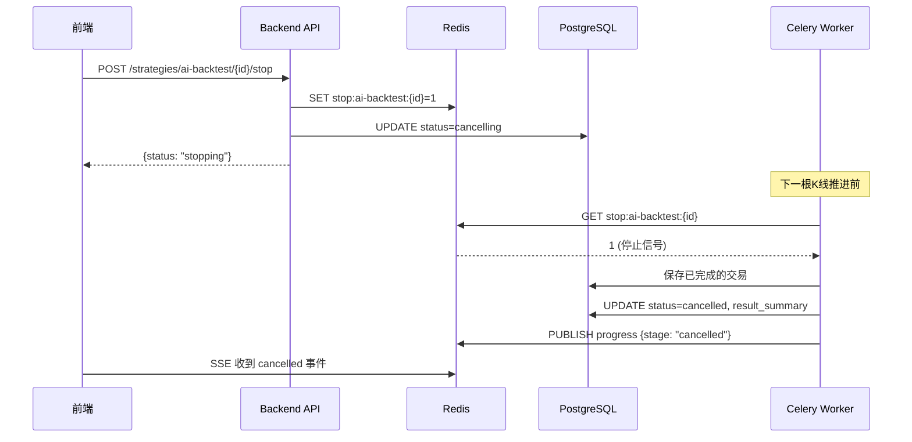
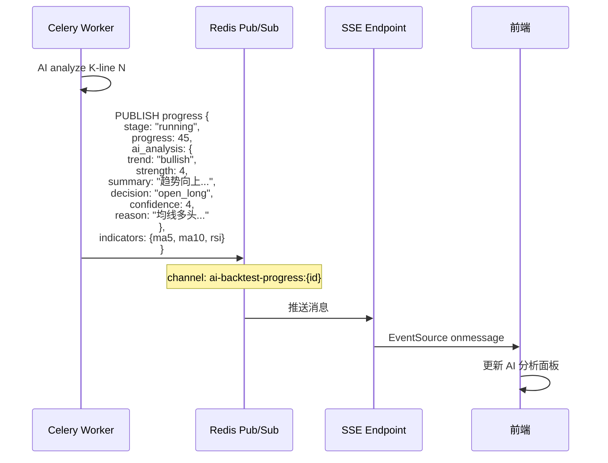
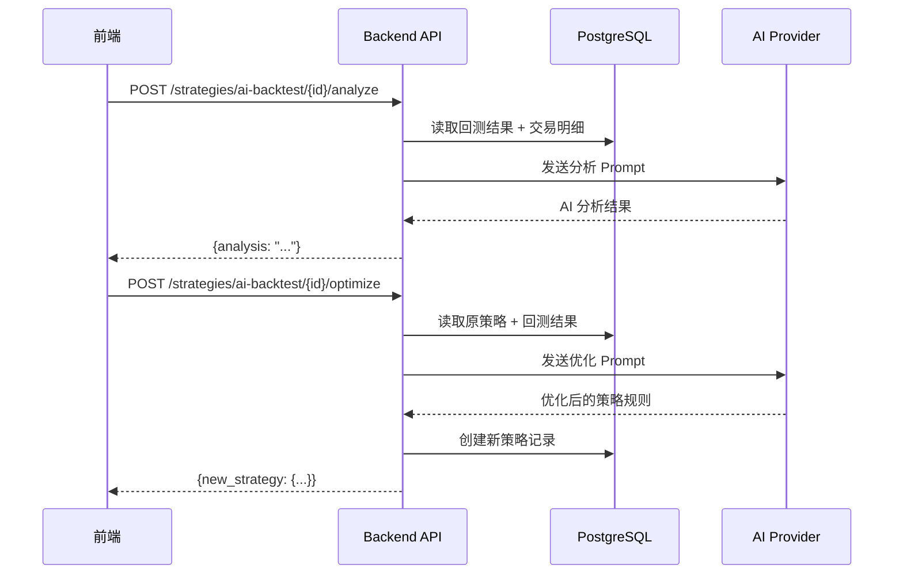

# AI 回测增强与终止功能设计方案

## 1. 背景与目标

### 1.1 背景

当前 AI 回测系统已支持自动逐根推进、AI 分析决策、交易记录保存等功能，但仍存在以下不足：

1. **无法终止运行中的回测**：当前 `cancel` 接口仅支持取消 `pending` 状态的回测，对于 `running` 状态的回测无法终止。
2. **回测过程中 AI 分析数据不可见**：SSE 进度推送仅包含进度百分比和当前持仓，不包含 AI 的实时分析内容（市场趋势、决策理由等）。
3. **回测完成后无 AI 总结分析**：回测结束后仅展示统计指标，缺少 AI 对整体表现的分析和建议。
4. **无法基于回测结果优化策略**：用户需要手动调整策略规则，缺少 AI 辅助优化功能。
5. **AI Provider 编辑行为不一致**：编辑已有 Provider 应直接修改，而非新建。

### 1.2 目标

1. 增加**终止运行中回测**功能，支持用户随时停止耗时过长的回测。
2. 在回测过程的 SSE 推送中，增加 **AI 分析数据**（市场趋势、决策理由、置信度等），前端实时展示。
3. 每次开单交易的 AI 分析在回测过程中即可查看，**不必等待回测完成**。
4. 回测完成后，增加**回测结果 AI 分析**功能，AI 对回测表现进行总结分析。
5. 增加**策略优化**功能，AI 基于回测结果生成**新的优化策略**（不修改原策略）。
6. **AI Provider 编辑**：编辑已有 Provider 时直接修改，区别于新建操作。

---

## 2. 功能需求

### 2.1 终止运行中回测

| 功能 | 说明 |
|------|------|
| 触发方式 | 前端"进度"Tab 中的"终止回测"按钮 |
| 后端处理 | 设置 Redis 停止标志 + 更新 DB 状态为 `cancelling` |
| Celery 行为 | 每根 K 线推进前检查停止标志，发现后优雅退出 |
| 结果状态 | 已完成的交易保留，未完成的丢弃，状态标记为 `cancelled` |

### 2.2 实时 AI 分析数据推送

| 功能 | 说明 |
|------|------|
| 数据内容 | 市场趋势(bullish/bearish/neutral)、趋势强度、分析摘要、决策理由、置信度、建议策略 |
| 推送时机 | 每根 K 线 AI 分析完成后，随进度一起推送 |
| 保存方式 | 开仓时 AI 分析 → 存入 `ai_backtest_trades.open_ai_analysis`，平仓时 AI 分析 → 存入 `exit_ai_analysis` |

### 2.3 回测结果 AI 分析

| 功能 | 说明 |
|------|------|
| 触发时机 | 回测完成后，用户点击"AI 分析"按钮 |
| 分析内容 | 整体表现总结、胜率/盈亏分析、策略执行质量、市场适应性、改进建议 |
| 数据源 | 回测结果摘要 + 所有交易明细 + 策略规则 |
| 展示方式 | 新页面/弹窗，Markdown 渲染 |

### 2.4 策略优化

| 功能 | 说明 |
|------|------|
| 触发时机 | 回测结果 AI 分析完成后，用户点击"优化策略" |
| 生成方式 | AI 基于原始策略 + 回测分析结果，生成新的策略规则 |
| 保存方式 | 创建全新的策略记录（`strategies` 表），与原策略无关 |
| 关联方式 | 可选：在新策略的 `extra` 字段中记录来源回测 ID |

### 2.5 AI Provider 编辑

| 功能 | 说明 |
|------|------|
| 新建 Provider | 调用 `POST /system/configs/ai` 创建新记录 |
| 编辑 Provider | 调用 `PUT /system/configs/ai/{id}` 更新已有记录 |
| 前端区分 | 弹窗区分"新建"和"编辑"两种模式 |

---

## 3. 总体架构设计

### 3.1 终止回测流程



### 3.2 实时 AI 分析数据推送



### 3.3 回测结果 AI 分析与策略优化



---

## 4. 数据库设计

### 4.1 已有表变更

**ai_backtests 表**：状态字段增加 `cancelling`、`cancelled` 值

```python
# 当前状态枚举
status: "pending" | "running" | "completed" | "failed"
# 增加后
status: "pending" | "running" | "completed" | "failed" | "cancelling" | "cancelled"
```

**strategies 表**：无需变更，新策略作为独立记录保存

### 4.2 数据结构变更

**SSE 进度推送 payload 增加字段**：

```json
{
  "backtest_id": "uuid",
  "stage": "running",
  "progress": 45,
  "current_kline": 225,
  "total_klines": 500,
  "current_trades": 3,
  "current_position": { ... },
  "message": "正在推进第 225/500 根 K 线",
  "ai_analysis": {                // 新增：当前 K 线的 AI 分析结果
    "trend": "bullish",           // 市场趋势
    "strength": 4,                // 趋势强度 1-5
    "summary": "多头趋势明确，成交量放大...",  // 分析摘要
    "decision": "open_long",      // 决策
    "confidence": 4,              // 置信度 1-5
    "reason": "均线多头排列，RSI 中性..."  // 决策理由
  },
  "indicators": {                 // 新增：当前技术指标
    "ma5": 45200,
    "ma10": 44800,
    "rsi_14": 62
  }
}
```

**回测结果 AI 分析结果结构**：

```json
{
  "overall_assessment": "策略表现良好，胜率65%，但最大回撤偏高...",
  "strengths": ["趋势跟踪准确", "止损设置合理"],
  "weaknesses": ["震荡行情中频繁开仓", "止盈设置偏保守"],
  "market_adaptability": {
    "trend_market": "优秀",
    "range_market": "一般",
    "volatile_market": "较差"
  },
  "improvement_suggestions": [
    "建议增加震荡行情过滤器",
    "建议上调止盈目标至 1:2 盈亏比",
    "建议在 RSI<30 时加仓"
  ],
  "score": 72
}
```

---

## 5. 接口设计

### 5.1 新增接口

| 方法 | 路径 | 说明 |
|------|------|------|
| POST | `/strategies/ai-backtest/{id}/stop` | 终止运行中的回测 |
| POST | `/strategies/ai-backtest/{id}/analyze` | 回测结果 AI 分析 |
| POST | `/strategies/ai-backtest/{id}/optimize` | 基于回测结果优化策略 |

### 5.2 SSE 进度推送增强

现有 `GET /strategies/ai-backtest/{id}/progress` 保持不变，但 payload 增加 `ai_analysis` 和 `indicators` 字段。

### 5.3 AI Provider 编辑

| 方法 | 路径 | 说明 |
|------|------|------|
| POST | `/system/configs/ai` | 新建 AI Provider |
| PUT | `/system/configs/ai/{id}` | 编辑已有 AI Provider |

---

## 6. 关键设计决策

### 6.1 终止回测方案选型

| 方案 | 优点 | 缺点 | 选择 |
|------|------|------|------|
| Redis 停止标志 | 实时、轻量、不依赖 DB | 需要额外清理 | **采用** |
| DB 状态轮询 | 持久化、可审计 | 查询频繁、延迟高 | 辅助 |
| Celery revoke | 官方支持 | 仅对 prefork 有效，不保证立即停止 | 备选 |

**最终方案**：Redis 停止标志为主，DB 状态为辅。

### 6.2 AI 分析调用时机

- **回测过程中**：每根 K 线 AI 分析完成后，将结果编码到 SSE payload 中
- **回测结果分析**：用户手动触发，一次调用分析全部回测数据
- **策略优化**：在结果分析基础上，用户手动触发，AI 生成新策略

### 6.3 策略优化保存策略

- 新策略作为独立记录保存在 `strategies` 表
- 名称格式：`{原策略名} - 优化版 v{版本号}`
- 通过 `extra.source_backtest_id` 字段关联来源回测
- 原策略完全不变

---

## 7. 与现有系统的关系

| 现有模块 | 影响 |
|---------|------|
| AIBacktest 模型 | 状态字段增加 `cancelling`、`cancelled` |
| AIBacktestService | 新增 `stop_backtest()`、`analyze_results()`、`optimize_strategy()` 方法 |
| run_ai_backtest 任务 | 主循环中增加停止信号检查 |
| SSE 进度推送 | payload 增加 `ai_analysis`、`indicators` 字段 |
| AI Provider 管理 | 区分新建和编辑，编辑使用 PUT 方法 |
| 前端 AIBacktestPanel | 新增"终止"按钮、AI 分析面板、策略优化按钮 |