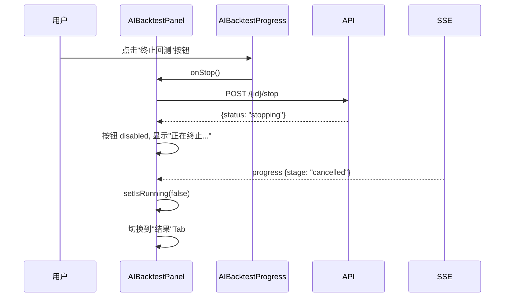
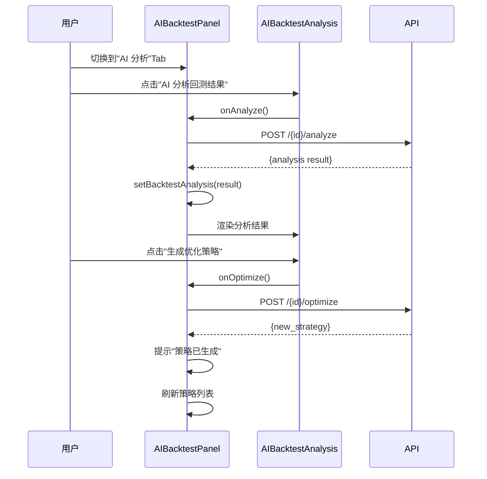

# AI 回测增强与终止 - 前端技术方案

## 1. 概述

本文档描述 AI 回测增强功能的**前端实现方案**，包括：
- 回测运行时增加"终止"按钮
- 回测过程中实时展示 AI 分析数据
- 回测完成后增加 AI 分析功能
- 基于回测结果生成优化策略
- AI Provider 编辑与新建区分

---

## 2. 页面变更

### 2.1 AIBacktestPanel 组件变更

**新增状态**：

```typescript
// 组件内部新增状态
const [aiAnalysis, setAIAnalysis] = useState<AIBacktestAIAnalysis | null>(null);
const [isAnalyzing, setIsAnalyzing] = useState(false);  // AI 分析中
const [isOptimizing, setIsOptimizing] = useState(false);  // 优化中
const [backtestAnalysis, setBacktestAnalysis] = useState<any>(null);  // 回测分析结果
```

**新增 Tab 页**：

```tsx
// AIBacktestPanel.tsx 新增 Tab
{
  key: 'analysis',
  label: 'AI 分析',
  disabled: !currentBacktestId || isRunning || detailQuery.data?.data?.status !== 'completed',
  children: (
    <AIBacktestAnalysis
      backtestId={currentBacktestId!}
      analysis={backtestAnalysis}
      isAnalyzing={isAnalyzing}
      onAnalyze={handleAnalyze}
      onOptimize={handleOptimize}
      isOptimizing={isOptimizing}
    />
  ),
}
```

**进度 Tab 增强**：实时展示 AI 分析数据

```tsx
{
  key: 'progress',
  label: '进度',
  disabled: !isRunning,
  children: (
    <AIBacktestProgressComp
      progress={progress}
      aiAnalysis={aiAnalysis}  // 新增
    />
  ),
}
```

### 2.2 SSE 回调增强

```typescript
// AIBacktestPanel.tsx 修改

const handleSSEMessage = useCallback((data: any) => {
  setProgress(data);
  // 提取 AI 分析数据
  if (data.ai_analysis) {
    setAIAnalysis(data.ai_analysis);
  }
}, []);
```

---

## 3. 组件设计

### 3.1 AIBacktestProgress 增强

**文件**：`frontend/src/pages/strategies/components/AIBacktestProgress.tsx`

**新增 AI 分析实时面板**：

```tsx
import React from 'react';
import { Card, Progress, Space, Typography, Spin, Tag, Statistic, Descriptions } from 'antd';
import type { AIBacktestProgress as AIBacktestProgressType, AIBacktestAIAnalysis } from '@/types/ai-backtest';

const { Text, Title } = Typography;

const TREND_MAP: Record<string, { label: string; color: string }> = {
  bullish: { label: '看涨', color: 'red' },
  bearish: { label: '看跌', color: 'green' },
  neutral: { label: '中性', color: 'default' },
};

const DECISION_MAP: Record<string, { label: string; color: string }> = {
  open_long: { label: '开多', color: 'red' },
  open_short: { label: '开空', color: 'green' },
  close_long: { label: '平多', color: 'orange' },
  close_short: { label: '平空', color: 'orange' },
  hold: { label: '持有', color: 'default' },
};

interface Props {
  progress: AIBacktestProgressType | null;
  aiAnalysis?: AIBacktestAIAnalysis | null;  // 新增
}

export const AIBacktestProgress: React.FC<Props> = ({ progress, aiAnalysis }) => {
  // ... 原有进度显示 ...

  return (
    <div style={{ maxWidth: 800, margin: '0 auto', padding: 24 }}>
      {/* 原有进度条 */}
      <Card style={{ marginBottom: 16 }}>
        {/* ... 进度条、统计数字 ... */}
      </Card>

      {/* 新增：AI 实时分析面板 */}
      {aiAnalysis && (
        <Card title="AI 实时分析" style={{ marginBottom: 16 }}>
          <Descriptions column={2} size="small" bordered>
            <Descriptions.Item label="市场趋势">
              <Tag color={TREND_MAP[aiAnalysis.trend]?.color || 'default'}>
                {TREND_MAP[aiAnalysis.trend]?.label || aiAnalysis.trend}
              </Tag>
            </Descriptions.Item>
            <Descriptions.Item label="趋势强度">
              {'★'.repeat(aiAnalysis.strength)}{'☆'.repeat(5 - aiAnalysis.strength)}
            </Descriptions.Item>
            <Descriptions.Item label="建议决策" span={2}>
              <Tag color={DECISION_MAP[aiAnalysis.decision]?.color || 'default'}>
                {DECISION_MAP[aiAnalysis.decision]?.label || aiAnalysis.decision}
              </Tag>
              <Text style={{ marginLeft: 8 }}>
                置信度: {'★'.repeat(aiAnalysis.confidence)}{'☆'.repeat(5 - aiAnalysis.confidence)}
              </Text>
            </Descriptions.Item>
            <Descriptions.Item label="分析摘要" span={2}>
              <Paragraph
                style={{
                  background: '#f5f5f5',
                  padding: 8,
                  borderRadius: 4,
                  fontSize: 12,
                  whiteSpace: 'pre-wrap',
                  margin: 0,
                }}
              >
                {aiAnalysis.summary}
              </Paragraph>
            </Descriptions.Item>
            <Descriptions.Item label="决策理由" span={2}>
              <Text>{aiAnalysis.reason || '-'}</Text>
            </Descriptions.Item>
          </Descriptions>
        </Card>
      )}
    </div>
  );
};
```

### 3.2 AIBacktestAnalysis 组件（新增）

**文件**：`frontend/src/pages/strategies/components/AIBacktestAnalysis.tsx`

```tsx
import React from 'react';
import {
  Card, Button, Typography, Spin, Empty, Space, Tag, Divider, Alert,
} from 'antd';
import {
  ThunderboltOutlined, RobotOutlined, FileAddOutlined,
} from '@ant-design/icons';

const { Title, Text, Paragraph } = Typography;

interface Props {
  backtestId: string;
  analysis: any | null;
  isAnalyzing: boolean;
  onAnalyze: () => void;
  onOptimize: () => void;
  isOptimizing: boolean;
}

export const AIBacktestAnalysis: React.FC<Props> = ({
  analysis, isAnalyzing, onAnalyze, onOptimize, isOptimizing,
}) => {
  return (
    <div>
      {/* 操作按钮 */}
      <Card style={{ marginBottom: 16 }}>
        <Space>
          <Button
            type="primary"
            icon={<RobotOutlined />}
            onClick={onAnalyze}
            loading={isAnalyzing}
            disabled={isAnalyzing}
          >
            AI 分析回测结果
          </Button>
          <Button
            icon={<FileAddOutlined />}
            onClick={onOptimize}
            loading={isOptimizing}
            disabled={!analysis || isOptimizing}
          >
            生成优化策略
          </Button>
          {!analysis && (
            <Text type="secondary">请先进行 AI 分析，再生成优化策略</Text>
          )}
        </Space>
      </Card>

      {/* 分析结果 */}
      {isAnalyzing ? (
        <div style={{ textAlign: 'center', padding: 60 }}>
          <Spin size="large" tip="AI 正在分析回测结果..." />
        </div>
      ) : analysis ? (
        <Card>
          {/* 综合评分 */}
          <div style={{ textAlign: 'center', marginBottom: 24 }}>
            <Title level={3}>
              综合评分: <Text type={analysis.score >= 70 ? 'success' : analysis.score >= 40 ? 'warning' : 'danger'}>
                {analysis.score}/100
              </Text>
            </Title>
          </div>

          {/* 整体评估 */}
          <Card size="small" style={{ marginBottom: 16 }}>
            <Paragraph>{analysis.overall_assessment}</Paragraph>
          </Card>

          {/* 优势与不足 */}
          <Space style={{ width: '100%' }} size={16}>
            <Card size="small" title="优势" style={{ flex: 1 }}>
              {analysis.strengths?.map((s: string, i: number) => (
                <Text key={i} style={{ display: 'block', marginBottom: 4 }}>
                  ✅ {s}
                </Text>
              ))}
            </Card>
            <Card size="small" title="不足" style={{ flex: 1 }}>
              {analysis.weaknesses?.map((w: string, i: number) => (
                <Text key={i} style={{ display: 'block', marginBottom: 4 }}>
                  ⚠️ {w}
                </Text>
              ))}
            </Card>
          </Space>

          <Divider />

          {/* 市场适应性 */}
          <Card size="small" title="市场适应性" style={{ marginBottom: 16 }}>
            {Object.entries(analysis.market_adaptability || {}).map(([market, level]) => (
              <div key={market} style={{ marginBottom: 8 }}>
                <Text strong>
                  {{
                    trend_market: '趋势市场',
                    range_market: '震荡市场',
                    volatile_market: '高波动市场',
                  }[market] || market}:
                </Text>
                <Tag
                  color={
                    level === '优秀' ? 'success' :
                    level === '良好' ? 'processing' :
                    level === '一般' ? 'warning' : 'error'
                  }
                  style={{ marginLeft: 8 }}
                >
                  {level}
                </Tag>
              </div>
            ))}
          </Card>

          {/* 改进建议 */}
          <Card size="small" title="改进建议">
            {analysis.improvement_suggestions?.map((s: string, i: number) => (
              <Alert
                key={i}
                message={`建议 ${i + 1}`}
                description={s}
                type="info"
                showIcon
                style={{ marginBottom: 8 }}
              />
            ))}
          </Card>
        </Card>
      ) : (
        <Empty description="点击上方按钮开始 AI 分析" />
      )}
    </div>
  );
};
```

### 3.3 AIBacktestResult 增强

在结果 Tab 中增加"AI 分析"入口：

```tsx
// AIBacktestResult.tsx 修改

// 在统计卡片下方增加
{detail?.status === 'completed' && (
  <Card size="small" style={{ marginBottom: 16 }}>
    <Space>
      <Button
        icon={<RobotOutlined />}
        onClick={() => onAnalyze?.()}
      >
        AI 分析回测结果
      </Button>
      {detail.result_summary?.ai_analysis && (
        <Tag color="success">已分析</Tag>
      )}
    </Space>
  </Card>
)}
```

### 3.4 AI Provider 编辑弹窗

**区分新建和编辑模式**：

```tsx
// 系统配置页面的 AI Provider 弹窗

interface AIProviderModalProps {
  open: boolean;
  mode: 'create' | 'edit';  // 新增模式标志
  provider?: SystemConfigItem;  // 编辑时传入
  onClose: () => void;
  onSuccess: () => void;
}

const AIProviderModal: React.FC<AIProviderModalProps> = ({
  open, mode, provider, onClose, onSuccess,
}) => {
  const [form] = Form.useForm();
  const isEdit = mode === 'edit';

  const handleSubmit = async () => {
    const values = await form.validateFields();
    if (isEdit) {
      // PUT /system/configs/ai/{id}
      await systemApi.updateAiConfig(provider!.id, values);
    } else {
      // POST /system/configs/ai
      await systemApi.createAiConfig(values);
    }
    onSuccess();
  };

  return (
    <Modal
      title={isEdit ? '编辑 AI Provider' : '新建 AI Provider'}
      open={open}
      onOk={handleSubmit}
      onCancel={onClose}
    >
      <Form
        form={form}
        initialValues={isEdit ? provider?.value : undefined}
      >
        {/* 表单字段 */}
      </Form>
    </Modal>
  );
};
```

---

## 4. 新增/修改类型定义

```typescript
// types/ai-backtest.ts 新增

// AI 实时分析（SSE 推送）
export interface AIBacktestAIAnalysis {
  trend: 'bullish' | 'bearish' | 'neutral';
  strength: number;       // 1-5
  summary: string;
  decision: 'open_long' | 'open_short' | 'close_long' | 'close_short' | 'hold';
  confidence: number;     // 1-5
  reason: string;
}

// SSE 进度（增加 AI 分析字段）
export interface AIBacktestProgress {
  backtest_id: string;
  stage: 'preheat' | 'running' | 'summary' | 'done' | 'error' | 'cancelled';
  progress: number;
  current_kline: number;
  total_klines: number;
  current_trades: number;
  current_position?: {
    has_position: boolean;
    direction?: string;
    entry_price?: number;
    unrealized_pnl?: number;
  };
  message: string;
  ai_analysis?: AIBacktestAIAnalysis;  // 新增
  indicators?: {                       // 新增
    ma5: number;
    ma10: number;
    rsi_14: number;
  };
}

// 回测结果 AI 分析响应
export interface AIBacktestAnalysisResult {
  overall_assessment: string;
  strengths: string[];
  weaknesses: string[];
  market_adaptability: {
    trend_market: string;
    range_market: string;
    volatile_market: string;
  };
  improvement_suggestions: string[];
  score: number;
}

// 回测结果摘要（增加 AI 分析）
export interface AIBacktestSummary {
  // ... 原有字段 ...
  ai_analysis?: AIBacktestAnalysisResult;  // 新增
}

// 策略优化结果
export interface AIBacktestOptimizeResult {
  id: string;
  name: string;
  rules: Record<string, any>;
}
```

---

## 5. API 接入

```typescript
// api/ai-backtest.ts 新增

export const aiBacktestApi = {
  // ... 原有方法 ...

  /** 终止运行中的回测 */
  stop: (id: string) =>
    request.post(`/strategies/ai-backtest/${id}/stop`),

  /** AI 分析回测结果 */
  analyze: (id: string) =>
    request.post<AIBacktestAnalysisResult>(`/strategies/ai-backtest/${id}/analyze`),

  /** 基于回测结果优化策略 */
  optimize: (id: string) =>
    request.post<AIBacktestOptimizeResult>(`/strategies/ai-backtest/${id}/optimize`),
};
```

---

## 6. 组件交互流程

### 6.1 终止回测流程



### 6.2 AI 分析流程



---

## 7. 状态管理

### 7.1 组件状态总览

```typescript
interface AIBacktestPanelState {
  // 运行状态
  isRunning: boolean;
  currentBacktestId: string | null;
  
  // SSE 实时数据
  progress: AIBacktestProgress | null;
  aiAnalysis: AIBacktestAIAnalysis | null;
  
  // 分析状态
  isAnalyzing: boolean;
  isOptimizing: boolean;
  backtestAnalysis: AIBacktestAnalysisResult | null;
  
  // 结果数据
  detailQuery: UseQueryResult;
  tradesQuery: UseQueryResult;
  
  // 取消状态
  isStopping: boolean;
}
```

### 7.2 按钮状态矩阵

| 场景 | 终止按钮 | AI 分析按钮 | 优化按钮 |
|------|----------|-------------|----------|
| 回测运行中 | 可点击 | 禁用 | 禁用 |
| 终止请求中 | 禁用+loading | 禁用 | 禁用 |
| 回测完成 (未分析) | 隐藏 | 可点击 | 禁用 |
| 回测完成 (分析中) | 隐藏 | 禁用+loading | 禁用 |
| 回测完成 (已分析) | 隐藏 | 可点击 (重新分析) | 可点击 |
| 优化中 | 隐藏 | 禁用 | 禁用+loading |
| 回测失败 | 隐藏 | 禁用 | 禁用 |

---

## 8. 路由与菜单

无需新增路由。AI 回测增强功能在现有 `AIBacktestPanel` 组件内部扩展，通过 Tab 切换实现。

| Tab | 变更 |
|-----|------|
| 配置 | 无变化 |
| 进度 | 增加 AI 实时分析面板、终止按钮 |
| 结果 | 增加 AI 分析入口按钮 |
| **AI 分析** | **新增 Tab**，含分析结果展示和策略优化 |
| 历史 | 无变化 |